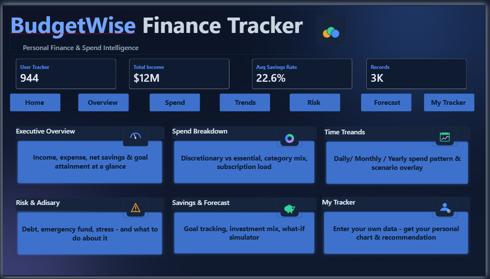
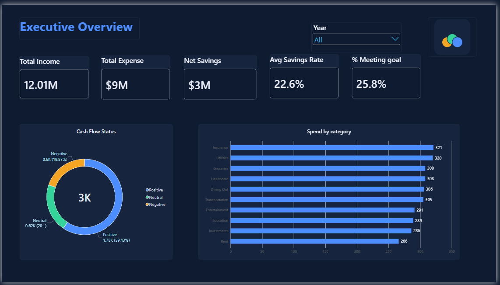
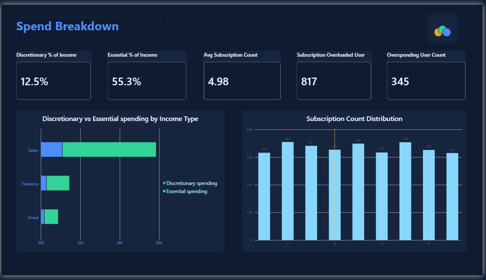
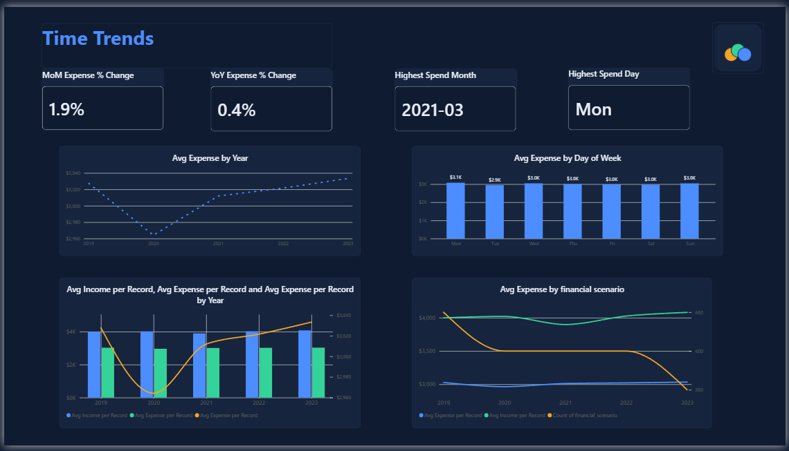
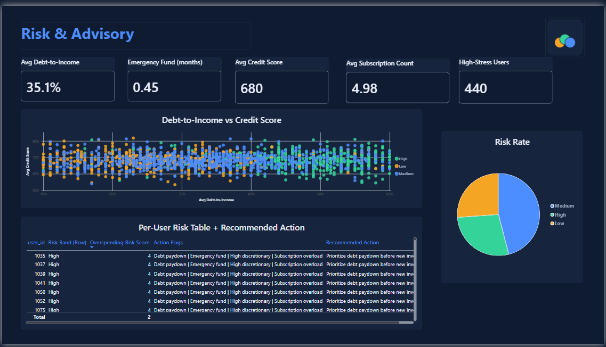
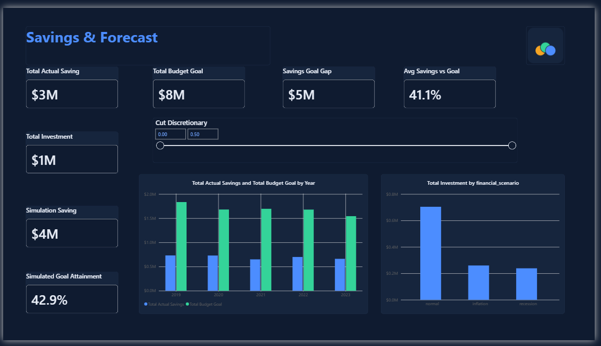
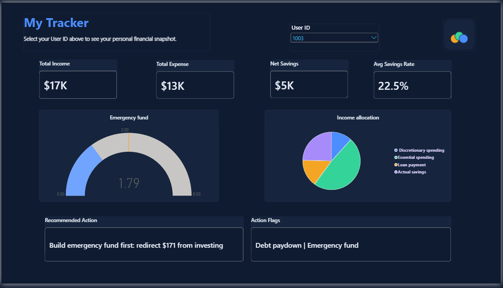

# 💰 BudgetWise Finance Tracker — Personal Finance & Spend Intelligence

> **An interactive Power BI dashboard for analyzing personal income, spending behavior, savings performance, debt risk, and financial advisory signals across a personal finance tracking dataset.**


---

## 🖼️ Dashboard Preview

### Home


### Executive Overview


### Spend Breakdown


### Time Trends


### Risk & Advisory


### Savings & Forecast


### My Tracker


---

## 📌 Project Overview

**BudgetWise Finance Tracker** is an end-to-end Power BI analytics project built to transform a personal finance tracking dataset into an interactive, decision-support dashboard.

The dashboard is designed from the perspective of someone who wants to understand:

- How their income compares to their spending
- Whether they're meeting their savings goals
- Where their money is going (essential vs. discretionary)
- Whether they are carrying too much subscription or debt load
- How their spending behaves over time
- What their personal financial risk level looks like
- What action they should take next, based on their own numbers

The final dashboard contains a **Home page + 5 analytical pages + a personalized "My Tracker" page**, connected through interactive navigation.

---

## 🎯 Project Objectives

1. Monitor overall income, expense, and net savings performance.
2. Measure how many users are meeting their savings goals.
3. Break down spending into essential vs. discretionary categories.
4. Identify subscription overload and overspending patterns.
5. Analyze debt-to-income ratio and emergency fund coverage as risk signals.
6. Surface time-based spending trends (yearly, day-of-week, by financial scenario).
7. Generate a personalized, rule-based financial recommendation per user.
8. Simulate the impact of reduced discretionary spending via a What-If parameter.

---

## 🧰 Tools & Technologies

| Tool / Technology | Purpose |
|---|---|
| **Microsoft Power BI** | Dashboard development and interactive reporting |
| **Power Query (M)** | Data cleaning, typing, and calendar table generation |
| **DAX** | Calculated columns, measures, KPIs, and advisory logic |
| **Python (pandas, scikit-learn)** | Predictive modeling (savings-goal classification) |
| **GitHub** | Project documentation and version control |

---

## 🖥️ Dashboard Structure

The dashboard is organized into seven pages:

### 1. 🏠 Home
A branded landing page with navigation cards to every analytical section.

### 2. 📊 Executive Overview
A high-level view of income, expense, net savings, and goal attainment.

### 3. 💳 Spend Breakdown
Focuses on discretionary vs. essential spending and subscription load.

### 4. 📈 Time Trends
Tracks average spend over time, by day of week, and by financial scenario.

### 5. ⚠️ Risk & Advisory
Surfaces debt-to-income, emergency fund coverage, and a per-user risk score with recommended actions.

### 6. 🎯 Savings & Forecast
Tracks goal attainment and lets the user simulate cutting discretionary spending via a What-If slider.

### 7. 👤 My Tracker
A personalized lookup page — select a user ID to see that person's own income, spending, emergency fund status, and tailored recommendation.

---

## 📊 2. Executive Overview

### KPI Cards
| Total Income | Total Expense | Net Savings | Avg Savings Rate | % Meeting Goal |
|---|---|---|---|---|
| $12.0M | $9.0M | $3.0M | 22.6% | 25.8% |

### Visuals
- **Cash Flow Status donut** — Positive (59.4%) / Neutral (20.7%) / Negative (19.9%)
- **Category Frequency chart** — share of periods tagged per spending category (Insurance, Utilities, Groceries, etc.)

> **Note:** the `category` field represents one tag per record, not a dollar breakdown — this chart is labeled "frequency," not "spend," to avoid misreading it.

---

## 💳 3. Spend Breakdown

### KPI Cards
| Discretionary % of Income | Essential % of Income | Avg Subscriptions | Subscription-Overloaded Records | Overspending Users |
|---|---|---|---|---|
| 12.5% | 55.3% | 4.98 | 817 | 345 |

### Visuals
- **Discretionary vs. Essential by Income Type** (stacked column)
- **Subscription Count Distribution** — highlights the pileup above the 4-subscription "overload" threshold

---

## 📈 4. Time Trends

### KPI Cards
| MoM Expense Change | YoY Expense Change | Highest Spend Month | Highest Spend Day |
|---|---|---|---|
| +1.9% | +0.4% | March 2021 | Monday |

> Trend measures use **average spend per record**, not totals — record counts vary month to month in this dataset, so a totals-based comparison would be distorted by volume rather than actual behavior.

### Visuals
- Average expense by year
- Average expense by day of week
- Average expense by financial scenario (overlay line chart)

---

## ⚠️ 5. Risk & Advisory

### KPI Cards
| Avg Debt-to-Income | Emergency Fund (months) | Avg Credit Score | High-Stress Users |
|---|---|---|---|
| 35.1% | 0.45 | 680 | 440 |

### Visuals
- **Debt-to-Income vs. Credit Score** scatter plot, colored by risk band
- **Risk Band distribution** donut (Low / Medium / High)
- **Per-user risk table** with computed `Recommended Action` and `Action Flags`, sorted by risk score

### Example DAX — Risk Scoring
```DAX
Overspending Risk Score =
VAR d = [Discretionary % of Income]
VAR t = [Avg Debt-to-Income]
VAR e = [Emergency Fund Coverage (Months)]
VAR s = [Avg Subscription Count]
RETURN
    IF(d > 0.20, 1, 0) +
    IF(t > 0.40, 1, 0) +
    IF(e < 1, 1, 0) +
    IF(s > 4, 1, 0)
```

---

## 🎯 6. Savings & Forecast

### KPI Cards
| Total Actual Savings | Total Budget Goal | Savings Goal Gap | Total Investment |
|---|---|---|---|
| $3M | $8M | $5M | $1M |

### Visuals
- Actual vs. Goal savings by year
- Total investment by financial scenario
- **What-If simulator** — slide "Cut Discretionary %" to see projected Simulated Savings and Simulated Goal Attainment update live

### Example DAX — What-If Measure
```DAX
Simulated Savings =
[Total Actual Savings] +
SUM(Fact_Finance[discretionary_spending]) * [Cut Discretionary Value]
```

---

## 👤 7. My Tracker

A single-select `user_id` slicer filters the whole page to one person's own data: their income, expense, net savings, emergency fund coverage (shown on a gauge against a 3-month target), and a personalized `Recommended Action`.

---

## 🧹 Data Preparation

The project followed a careful data-profiling workflow before any dashboard logic was built:

- Verified the dataset is a set of independent snapshots, not a true per-user time series
- Recalibrated advisory thresholds against real data distributions instead of assumed defaults (e.g. the discretionary-overspend threshold was adjusted from >30% to >20% after testing showed the original threshold fired for under 3% of records)
- Used average-based measures instead of sum-based measures for all month-over-month and year-over-year comparisons, since record counts vary by month
- Disclosed where advisory rules overlap heavily (e.g. ~39% of records trigger the debt-paydown rule, ~57% trigger the emergency-fund rule) rather than presenting them as rare edge cases

---

## 🤖 Predictive Layer (Python)

A supplementary Python script (`budgetwise_predictive_model.py`) trains two models on the dataset:

| Model | Target | Result |
|---|---|---|
| Random Forest Regressor | Monthly expense total | MAE 635.91, R² ≈ -0.01 (weak — expected, since the data isn't a true panel) |
| Random Forest Classifier | Savings goal met | Accuracy 0.907, ROC AUC 0.931 (strong) |

Predictions are exported to `predictions.csv` for optional merge into the Power BI model.

---

## 🎨 Dashboard Design System

BudgetWise Finance Tracker uses a consistent dark, finance-focused visual language.

| Purpose | Color | HEX |
|---|---|---|
| Background | Deep Navy | `#0F1B30` |
| Card Background | Slate Navy | `#16253D` |
| Border | Blue Gray | `#22334F` |
| Main Text | Off White | `#E8EDF7` |
| Secondary Text | Slate Gray | `#94A3B8` |
| Primary Accent | Electric Blue | `#4C8DFF` |
| Success | Emerald | `#34D399` |
| Highlight | Amber | `#F5A524` |
| Secondary Accent | Violet | `#A78BFA` |

---

## 💡 Key Dashboard Insights

- Total income across all records is approximately **$12.0M**, against **$9.0M** in total expense.
- Only about **25.8%** of users are meeting their stated savings goal.
- Average subscription count is **4.98**, with over 800 records exceeding the 4-subscription overload threshold.
- Average emergency fund coverage is under **half a month**, well below the 3–6 month recommended range.
- Day-of-week and financial-scenario effects on spending are both small in this dataset — spending is largely stable regardless of these factors.

> These observations describe the current dataset snapshot. They are not forecasts or causal conclusions.

---

## 🔄 Interactive Features

- Multi-page navigation with icon-labeled buttons
- Cross-filtering between visuals (e.g. Risk Band donut filters the risk table)
- A personalized user-lookup page (My Tracker)
- A live What-If simulator for discretionary spending cuts
- Dynamic, rule-based DAX advisory logic per record

---

## 🚀 How to Use

1. Clone or download this repository.
2. Open `BudgetWiseFinanceTracker.pbix` in Microsoft Power BI Desktop.
3. If the dataset path is different: go to **Home → Transform data → Data source settings** and update the source location.
4. Refresh the data: **Home → Refresh**.
5. Use the navigation buttons to move between Home → Overview → Spend → Trends → Risk → Forecast → My Tracker.

---

## 🧠 Skills Demonstrated

- Power BI, Power Query, DAX
- Data Cleaning & Data Profiling
- KPI Development & Advisory Logic Design
- What-If Parameter Simulation
- Predictive Modeling (Python / scikit-learn)
- Dashboard UI/UX & Interactive Navigation
- Data Storytelling

---

## 👨‍💻 Project Type

**Portfolio Project — Business Intelligence / Data Analytics (Capstone)**

### Project Name
**BudgetWise Finance Tracker**

### Domain
**Personal Finance Analytics**

### Primary Tool
**Microsoft Power BI**

---

## ⭐ Final Summary

**BudgetWise Finance Tracker** is a Power BI-based personal finance analytics dashboard that transforms individual financial records into actionable, personalized insight. The project combines careful data profiling, DAX-driven advisory logic, a What-If savings simulator, and a personalized lookup page to deliver a complete analytical experience — from a high-level financial overview down to one person's own recommended next step.
